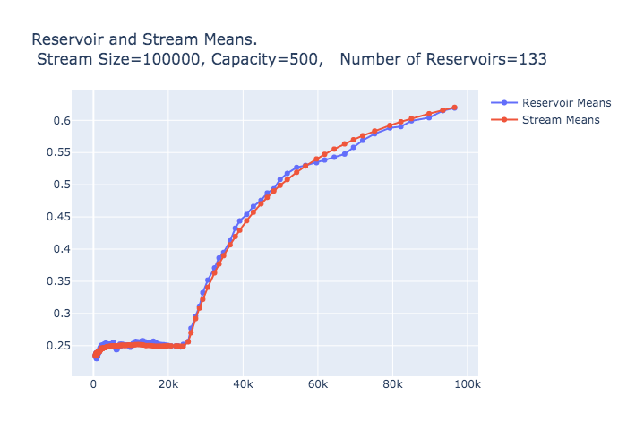

<!--Aim for ~1500 words including code fragments.-->

<!-- Rework examples: 1) histogram visualization. 2) means using same data as histogram example, but only exporting means to yaml. Ideally, the means would be sent to a Dash/Plotly webapp that live updates as the code runs-->

<!-- To do:
- Example 2:
	- use normal distr's stream
	- within iteration, calculate means of reservoirs and index for portion of stream used 
	- save means, index to yaml
- deal with step size -- remove or discuss 
- add captions to figures
- format figures
- make graphs resize on mobile -- remove zoom and other interactive features from Plotly

-->
# Iterative Methods: Reservoir Sampling

This is the third post in the series presenting the iterative_methods_in_rust crate. You may want to read the [first](http://daniel-vainsencher.github.io/book/iterative_methods_part_1.html) or [second](http://daniel-vainsencher.github.io/book/iterative_methods_part_2.html) by [Daniel Vainsencher](https://github.com/daniel-vainsencher) before reading this post.

This post describes how the Iterative Methods in Rust crate facilitates easy reservoir sampling as part of your iterative method of choice. [Reservoir sampling](https://en.wikipedia.org/wiki/Reservoir_sampling) produces an up-to-date and relatively low cost sample of a large stream of data of possibly unknown size. For example, suppose you want to maintain an up-to-date sample of tweets from a twitter feed in order to calculate statistics, but that including every tweet in the computations is too costly. A reservoir sample of the tweets will have a distribution that approximates the distribution of the stream (up to the point sampled) but, is smaller and is updated less frequently; this allows for cheaper computations of statistics about the stream.

Here I will describe the basic idea of the algorithm behind reservoir sampling; in a later section I will provide the technical details. Say more...

## Outline of the Post
- The UI for reservoir samples
- Example: Reservoir Histograms: Visualizing the Evolving Distribution  
- Example: Reservoir Means: Estimating the Evolving Mean
- Yaml, StepBy and making the Visualizations
- Testing the implementation 

## The UI for Reservoir samples using the `Iterative Methods in Rust` crate 

The UI uses adaptors to transform the behavior of `StreamingIterator`s. Suppose that `stream` is a `StreamingIterator` with items of type `T`. We adapt that iterator using `reservoir_iterable()`, so that each item of the new `StreamingIterator` is a `Vec<T>`, where the vector holds a reservoir sample. The number of items in the vector is known as the capacity.
```rust, ignore
let capacity = 500;
let res_iter = reservoir_iterable(stream, capacity, None);
while let Some(item) = res_iter.next() {
	// do stuff with each reservoir;
	// each item of the iterator is now a reservoir sample, 
	// not a single item of the original stream
}
```
Let's look at an example demonstrating the utility of both the UI and reservoir sampling.

### Reservoir Histograms: Visualizing the Evolving Distribution 

Suppose that we have a stream of data for which the distribution changes. For example, suppose that `stream` is a `StreamingIterator` of floats for which the first quarter of the stream is generated by a normal distribution with mean \\( \mu = 0.25\\) and standard deviation \\(\sigma = 0.15\\), but that the final three-quarters of the stream is generated by a normal distribution with \\( \mu = 0.75\\), \\( \sigma = 0.15\\) &mdash;the mean jumps from \\( 0.25\\) to \\( 0.75\\). Here are histograms showing the initial and final distributions of the stream:

<iframe id=iframe_embed allowtransparency="true" style="border:none; background-color: #000000;" src="reservoir_histograms_initial_final.html" height="600" width="900" title="Initial and Final Stream Distributions"> </iframe>

The reservoir sample starts off approximating the initial normal distribution but gradually shifts to approximate the total distribution, which is a sum of two normal distributions. Here is an animation showing how the reservoir distribution evolves. 

<iframe id=iframe_embed style="border:none;" src="reservoir_histogram_animation.html" height="600" width="900" title="Reservoir Distribution Approximate Stream Distribution"> </iframe>


### Estimating the Evolving Mean

[This needs to be swtiched to use the means of the above.]

Building on the previous example, suppose that we want to track how the mean of the stream evolves. Reservoir sampling allows us to make cheaper computations (that is, faster and using less memory) to estimate the mean as the stream is processed. The Iterative Methods library allows us to use the kind of flexible adaptors you are used to from Rust's `Iterator`s to accomplish this. We'll plot the reservoir means vs. the true means of the portion of the stream that was sampled. In order to know which portion of the stream has been sampled for each reservoir, we'll prepare the stream by enumerating its items with the `enumerate()` adaptor. This wraps each item of a `StreamingIterator` in a `Numbered {count, item}` struct that contains the original item and the index of the item. All of the adaptors are lazy, so the enumeration is added on the fly as the stream is processed. We'll also use the `write_yaml_documents()` adaptor to write the mean and index pairs to file.  

Here is the code that accomplishes this. The code is modular; once the data stream exists we adapt, adapt, adapt, in whichever sequence is currently useful. Again, we suppose that `stream` is our `StreamingIterator` full of float samples from the pair of distributions as described above. As before, after the `reservoir_iterable()` the items are reservoir samples, and after the `map` adaptor they are `Numbered` structs consisting of the mean of the reservoir and the index indicating how much of the stream was sampled to obtain that reservoir.   
```rust, ignore
let stream = enumerate(stream);
let stream = reservoir_iterable(stream, capacity, None);
let stream = stream.map(|reservoir| {
    let max_index = reservoir
        .iter()
        .map(|numbered| numbered.count)
        .max()
        .unwrap();
    let mean: f64 = reservoir
        .iter()
        .map(|numbered| numbered.item.unwrap())
        .sum();
    let mean = mean / (capacity as f64);
    Numbered {
        count: max_index,
        item: Some(mean),
    }
});
let mut stream = write_yaml_documents(stream, reservoir_means_file.to_string())
        .expect("Create File and initialize yaml iter failed.");
while let Some(item) = stream.next() {
	// 
}
```


With the sequence of reservoir samples written to a Yaml file we can now visualize or analyze the reservoirs and compare them to the stream. For example, let's compare the mean of the reservoir and the mean of the portion of the stream from which the reservoir sample was drawn. In the figure below, we see that the mean of the reservoir does a nice job, at least visually speaking, of approximating the stream. (The analytics and visualizations were produced using Python and Plotly.) [Calculate stats for the final reservoir mean over a bunch of runs.]




<!-- 

Here is some code I typed into the md file:
```rust, ignore
let iter = reservoir_iterator(iter);
let iter = enumerate(iter);
```

Here is some code referenced from a file:
```rust, ignore
{{#include res_sampling_example.rs:28:30}}
```

New content appears when pushed to origin?

With mathjax we can format inline equations \\( p = \frac{log m}{log n}\\) and block equations  \\[ p = \frac{log m}{log n}\\] -->