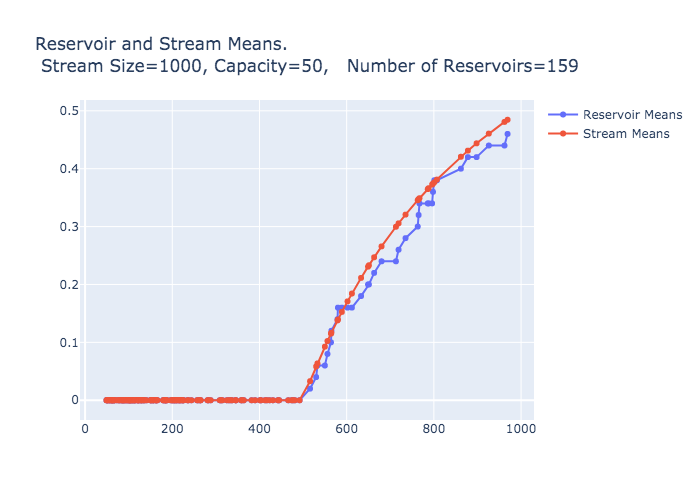

# Iterative Methods: Reservoir Sampling

This is the third post in the series presenting the iterative_methods_in_rust crate. You may want to read the [first](http://daniel-vainsencher.github.io/book/iterative_methods_part_1.html) or [second](http://daniel-vainsencher.github.io/book/iterative_methods_part_2.html) by [Daniel Vainsencher](https://github.com/daniel-vainsencher) before reading this post.

This post describes how the Iterative Methods in Rust crate facilitates easy reservoir sampling as part of your iterative method of choice. [Reservoir sampling](https://en.wikipedia.org/wiki/Reservoir_sampling) produces an up-to-date and relatively low cost sample of a large stream of data of possibly unknown size. For example, suppose you want to maintain an up-to-date sample of tweets from a twitter feed in order to calculate statistics, but that including every tweet in the computations is too costly. A reservoir sample of the tweets will have a distribution that approximates the distribution of the stream (up to the point sampled) but, is smaller and so allows for cheaper computations.

## Outline of the Post
- The UI for reservoir samples
- Examples on toy data demonstrating some of the properties of reservoir sampling
	- Approximating the mean of the full data stream
	- Approximating the distribution
- The algorithmic implementation
- Testing the implementation 



Here are the initial and final distributions of the stream where the image is embedded using an iframe:

<iframe id=iframe_embed style="border:none;" src="reservoir_histograms_initial_final.html" height="600" width="900" title="Initial and Final Stream Distributions"> </iframe>

Here is an animation showing how the reservoir distribution evolves. It tracks with stream distribution as that evolves, eventually approximating the distribution of the entire stream.

<iframe id=iframe_embed style="border:none;" src="reservoir_histogram_animation.html" height="600" width="900" title="Reservoir Distribution Approximate Stream Distribution"> </iframe>


<!-- 

Here is some code I typed into the md file:
```rust, ignore
let iter = reservoir_iterator(iter);
let iter = enumerate(iter);
```

Here is some code referenced from a file:
```rust, ignore
{{#include res_sampling_example.rs:28:30}}
```

New content appears when pushed to origin?

With mathjax we can format inline equations \\( p = \frac{log m}{log n}\\) and block equations  \\[ p = \frac{log m}{log n}\\] -->